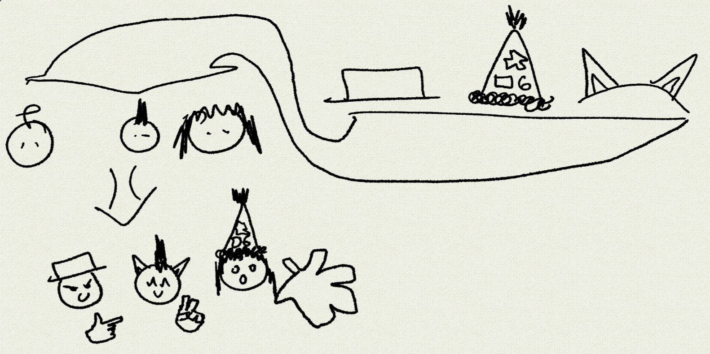

## Rules:

Each round is played in multiple stages. Stage 2 takes place after stage 1 ends, and the scoring stage takes place after stage 2 ends.

The Game Administrator has the final word on all issues regarding the interpretation of the rules text and on issues for which the rules text does not specify a resolution.

++/∘++/ = ++/∘++/∗

## Stage 1
During the duration of stage 1, any person on the server can make a "submission" by sending it to the Game Adminstrator through a direct message. 
From this point on, they are considered a "player" of the round. A player can only have 1 submission.
“A "person" is anyone the Game Adminstrator acknowledges as having ever taken action within the game.”

The submission must consist of a description of an alteration they wish to make to the rules text, described in any sufficiently easy to understand format.

### Rounds of Restriction

Every third round is a themed round, which has some contrived restriction or theme upon submissions.

The previous winner of a themed round agrees with the Game Admin on what this will be.

  

## Stage 2
At the beginning of stage 2, the submissions given during stage 1 are shuffled, assigned numbers and made public.
The players are now tasked with determining which submission was uploaded by which player.
These "guesses" are represented as partial bijections, meaning that each submission is paired with at most 1 unique player and each player is paired with at most 1 unique submission.

The first time you guess, you learn how many of your neighboring entries have been guessed by you correctly

## Scoring stage
After stage 2, each player receives 1 point for each player they guessed, and loses 1 point for each player that guessed them.
The players with the most points are the winners of the round.

in case of a tie in points, whichever entry has a sha256 hash closer to the sha256 hash of the next tweet of the prime minister wins.  if there is a tie between sha256 hash closenesses, sha256 hash of the next next tweet tiebreaks.  repeat until the tie is resolved

"its the prime minister of poland" 

The rules alternations submitted by each of the winning players are all enacted by the Game Adminstrator, and go into effect at the start of the next round.

After the scoring stage ends the round is over, and a new one may begin.

## Marbles
Each player will now have a number of marbles that carry on into future rounds. This amount is public information. Players will start with zero marbles, and will earn one marble for each correct guess they make during the guessing phase. If a player tries to do an action that would result in some player having fewer than zero marbles, that action fails, with that player being told "you have lost your marbles". Further, each player gets their number of marbles divided by 10 and then rounded down added to their score during the scoring phase. The following actions can be made using marbles:
1. Rolling a marble - gives one of your marbles to a specified player
2. Shooting a marble - uses one of your marbles to remove one marble from a specified player
4. 100 marbles - win the game

## The Swindler's Wagon

The Swindler is an esteemed role, an important member of the community who supplies itums to those most in need.

Their Wagon is a persistent collection of itums and prices.

The Swindler may optionally:
- discard a chosen itum from the wagon
- provide a description &c of an itum to stock into the wagon

Then they sellout, choosing another player or the Game Adminstrator to become the Swindler.  Each player may be Swindler only once per round.

The Game Adminstrator names prices for all wagon itums, and may change them at will.  A price must include some amount marbles or other money, and may include other things too.

If who's the Swindler is unclear, or the they have not taken an action for half a Pluto-day (~3 Earth-days), the Game Adminstrator may take their role.

### Till

When a player moves to buy an itum, the itum is taken from the Wagon and bidding is started.  Players from the past two rounds may bid privately.  All bids must have at least the counts in the asking price or higher, and may not include things not in the price.  Bids are rejected if they cannot be proven payable.

When bidding ends, the person with the highest bid gets the itum, and they pay the second highest bid.  Neither the Game Adminstrator nor Swindler receive the payment.

### mideas

Not as part of this rule, the authors suggest the following as itums for the Game Adminstrator to start the Wagon with, or just as sparks for the Swindler's imagination:
- Receipt — When used choose any player's itum to return to the Wagon
- Marble Jar — Contains how many marbles it was bought for.  these may not be shot.
- Appendage Pro Subscription — Pro subscribers append two words at a time.
- Invisible Ink — add a clause to a contract that other signers cannot see.
- Twins — Unilaterally destroy a contract.
- Pawn A — If held by the same player for 6 consecutive rounds, becomes Queen A.  Then, when used with Queen B, the user becomes Game Adminstrator.
- Pawn B —  〃 swap A & B.
- Hailstones — Sacrifice all points in Scoring and have every other player gain a Marble.
- Various Hats, Cat Ears, etc
- Itums don't need to do anything special!
- Pokéball — https://music.youtube.com/watch?v=BDaH0OF_zFY
- Weighted Bag — Swap with another person's item.

## Itums

Itums have a name and description.  Optionally they can have a little drawing too.  There can not exist identical itums.

The holder of an itum is affected by it's description.  Interpretation of what each itum actually bloody does is up the the Game Adminstrator.

Itums cannot override explicit rules, however are free to play with the rules and alter the game.

## Insert Tits Here

The Game Adminstrator may choose to give people Tit(le)s, to slack off on work.

Tit(le)s must be amusingly named, if they are found not they are instantly revoked.

There is only one of each Tit(le), and the Game Adminstrator may grant and revoke them.

A Tit(le) grants the holder the Game Adminstrator's abilities from a selection of the rules text.  That is, the Game Adminstrator picks a subset of the rules text (not necessarily contiguous), and a person - this selection of the rules text now applies as though instances of "the Game Adminstrator" (et sim.) were replaced with the person's name.

## sorry

any player may ohno at the cost of sorry

## Messing with time
The durations of stages, happenings of undefined length, and the time gaps between rounds are entirely determined by the Game Adminstrator. The Game Adminstrator may issue time extensions without the need to specify a reason for the extension.

# Contract law  
Players may enter into contracts with other players. In order for a contract to be valid, it must contain obligations and signatures and be submitted to the Game Adminstrator who will enforce the contract's terms. A contract may also contain penalties.   
## Obligations  
Any person who has an obligation is considered a party to a contract. An obligation constraints the future actions of each party to the contract. It may enforce positive action, such as but not limited to submitting a particular rule change submission, or telling a person some information. It may also enforce negative action, such as but not limited to not guessing a submission, or keeping information confidential. Conditions may be specified where an obligation only exists if those conditions are met. Obligations can only be actions that are related to the game, and cannot be things external to the game. If possible the Game Adminstrator should proceed as if obligations are followed, for example if a contract stipulates that a player must make a particular submission, then the game should proceed as if that player made that submission, even if the player attempted to submit something else.   
## Signature  
A valid contract must have a signature for every party in a contract. A signature is any proof that a party has accepted the contract that the Game Adminstrator is willing to accept.   
## Penalties  
In the case of obligations that cannot be ensured by the Game Adminstrator, penalties that will be applied if a party does not follow their obligations may be listed. A penalty is any obligation that can be enforced by the Game Adminstrator.   
  
# Meowing  
Players may meow, bark, or produce other such cute animal sounds.  These actions will be collectively referred to as “meowing” throughout the rest of this document.  Meowing is classified as an official game action, and as such will be tracked by the Game Adminstrator (see Meowing§Tracking).  Any and all collected meowing information and/or statistics are to be publicly available upon request from the Game Adminstrator.  
## Tracking  
Statistics about meowing performed by players, including but not limited to frequency and number of occurrences, are tracked by the Game Adminstrator.  The Game Adminstrator MUST track this information in a privacy-friendly manner, i.e. a manner which does not allow individuals to be identified from their informwation being tracked.  
  
# Endorsements  
At the end of each round, after guesses are finalized and scores are calculated, but before identities or guesses or scores are announced or any new rules are enacted, each Player is given (in private) the choice to either Endorse any individual Player, or not. Here a Player is anyone who submitted in the round in question.   
  
Next, for every Player P, compute P's Endorsement Score as 1 + (the sum of the Endorsement Scores of every Player that Endorsed P). To keep this well defined, disregard every Player that is part of a cycle in the directed graph of Endorsements: those players' Endorsement Scores are effectively zero.  
  
If the rules define a role of "President", then replace 1 in the above equation with 3 when P is the President.  
  
Then, the Player(s) with the greatest Endorsement Scores have their rule submission enacted, the same as if they had won through guessing.  
  
The information about who Endorsed whom is revealed by the Game Adminstrator along with everything else at the end of the round.  
  
# Tab 4  
Each stage, you may visit the Game Adminstrator to learn 2 things in private: 1 is true & 1 is false.

This is a silly game. Participants of all roles must not stress too much about unforeseen consequences of their actions, for those are what make the game fun.

every new rule applies retroactively, assuming everyone in past rounds would have acted in the same way with the rule as they did without.

## The Ghost of Guessing Past

During the Guessing Phase, the Willbound must write a submission that follows the Will, a contrived requirement, left to them by their ancestor.  Then write a Will, and pick their descendant.

If the Willbound does not do their duty, the Game Adminstrator chooses a next-of-kin to be Willbound next round.

The Willed submission appears in addition to other submissions in the next Guessing Phase, and “*as willed.*” appears in the player list.

The Will and who is or was Willbound are not made public by the Game Adminstrator, but the Willbound is not forbidden from telling.
 
Players gain a point for correctly guessing which is the Willed submission, and it looses a point each time it is guessed correctly.  It gains points equal to the average correct guesses this round.  It is distinct from the player who was Willbound and their submission, if any.

## Deck
The Deck is a collection of cards without order. The Deck and its contents are to be remembered publicly forevermore. The Discard is a collection of cards with order. The Discard and its contents are to be remembered publicly forevermore.

At any time one may draw a uniformly random card from the Deck. When a card is drawn, its effect is triggered by the one who drew it, and it is subsequently placed on the Discard. When one draws from an empty Deck, the names and properties of the Deck and Discard are first swapped. If the Deck is still empty, they draw The End, which removes George from the rules text.

Effects are not optional. If an effect cannot be resolved, it is not.

Any person may choose that they are only able to draw at most one card per round.

# Appendagealism  
  
The Appendage is a section of the rules.  
  
Going around the most recent player list, each player may append a word and optional punctuation mark to the Appendage.  They must be able to know the contents if desired (such as being public, or sent to them).  When reaching the end of the player list, repeat.  
  
Sentences in the Appendage aren't considered rules until completed by appropriate punctuation.  
  
Interpretation (but not enforcement) of the Appendage is up to the Appendicks, who is nominated by the Game Adminstrator (they cannot nominate themselves).  If over 50% of players from the previous and current round agree the Appendicks is causing Appendicitis, then Appendectomy is is performed, Entity *Appendicks=0;  
  
“Appendagealism – A rare term referring to a philosophy or view that emphasizes the importance of attachments or secondary elements in a system.”—ChatGPT  

# Appendage
when the impostor is REQUIRED to submit, they leak their entry's first syllable publicly. This impostor is the second kinkmaster to president in one election. Elections erect loudly when you
