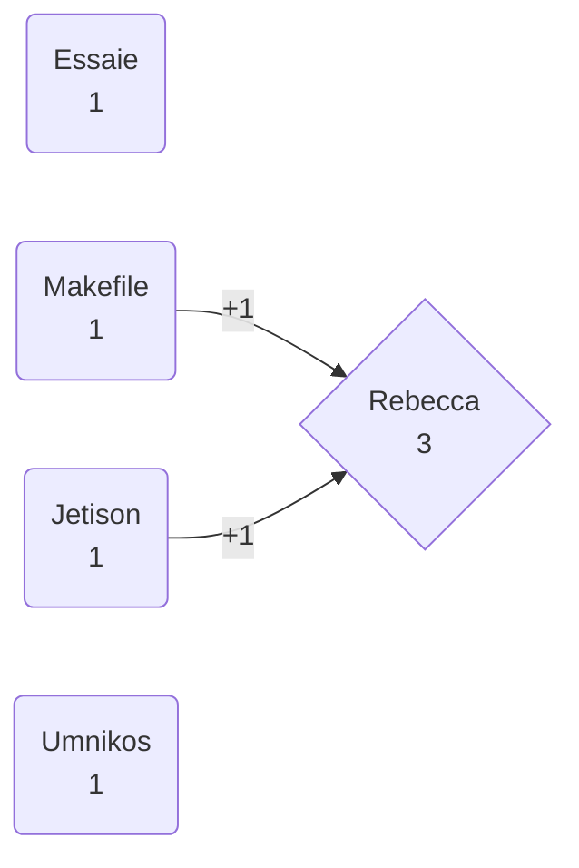

## guesses
1. rebecca — 3 correct, guessed 3 times.
   - 2 - **essaie**
   - 3 - **makefile**
   - 4 - **as willed**
   - 5 - umnikos
   - 6 - jetison
2. essaie — 3 correct, guessed 3 times.
   - 1 - **rebecca**
   - 2 - **essaie**
   - 3 - **makefile**
   - 4 - umnikos
   - 5 - *as willed*
   - 6 - jetison
3. makefile — 1 correct, guessed 4 times.
   - 1 - jetison
   - 2 - rebecca
   - 3 - **makefile**
   - 4 - umnikos
   - 5 - *as willed*
   - 6 - essaie
4. *as willed* — avg. 2.8 correct, guessed 2 times.
5. jetison — 4 correct, guessed 2 times.
   - 1 - **rebecca**
   - 2 - **essaie**
   - 3 - umnikos
   - 4 - **as willed**
   - 5 - **jetison**
   - 6 - makefile
6. umnikos — 3 correct, guessed 1 time.
   - 1 - **rebecca**
   - 2 - *as willed*
   - 3 - essaie
   - 4 - makefile
   - 5 - **jetison**
   - 6 - **umnikos**

## score

1. rebecca — 0 (+3 guess -3 guessed)
2. essaie — 1 (+3 guess -3 guessed +1 marbles)
3. makefile — -3 (+1 correct -4 guessed)
4. *as willed* — 0.8 (+2.8 avg. correct -2 guessed)
5. jetison — 3 (+4 correct -2 guessed +1 marbles)
6. umnikos — 4 (+3 correct -1 guessed +2 marbles)

Winner:  umnikos!

__TODO: Grant the marbles for correct guesses.__

## endorsements

Winner:  rebecca with 3!

