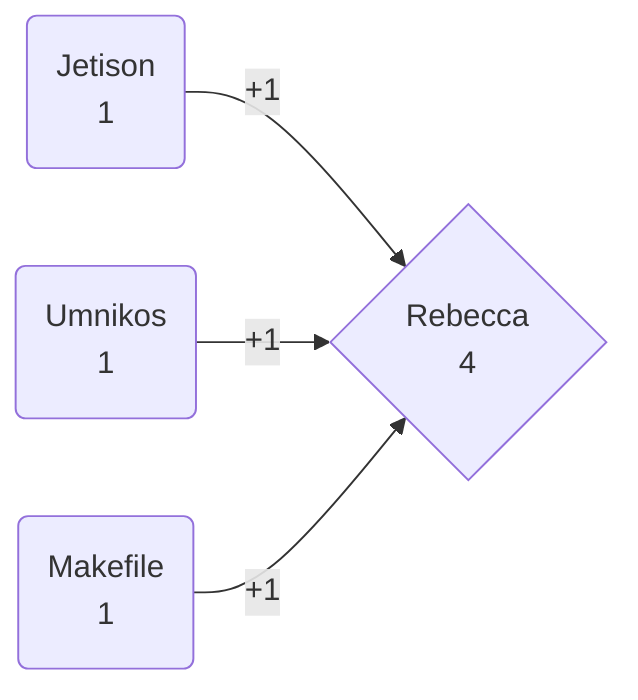

## guesses

1. jetison — 4 correct, guessed 3 times.
   - 1 - **jetison**
   - 2 - **umnikos**
   - 3 - **makefile**
   - 4 - **rebecca**
2. umnikos — 4 correct, guessed 3 times.
   - 1 - **jetison**
   - 2 - **umnikos**
   - 3 - **makefile**
   - 4 - **rebecca**
3. makefile — 4 correct, guessed 3 times.
   - 1 - **jetison**
   - 2 - **umnikos**
   - 3 - **makefile**
   - 4 - **rebecca**
4. rebecca — 1 correct, guessed 4 times.
   - 4 - **rebecca**

## score

1. jetison — 1
2. umnikos — 1
3. makefile — 1
4. rebecca — -3

Winner:  jetison, umnikos, and makefile!

## endorsements

Winner:  rebecca!

## votes

1. jetison — 2
   - jetison
2. umnikos — 1
   - umnikos
   - rebecca
   - jetison
3. makefile — 0
   - rebecca
4. rebecca — 3
   - rebecca

Selected President:  rebecca!

*(Note: Originally there was a miscount where jetison and rebecca did a tie with both 2 votes.)*

