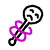

# Items
Mexican Square Wave (1 marble) — Pass to another player. If passed through the entire player list in a round, the last to receive gains a marble, and chooses a new type of wave for this to be named. 

Bowl of Sherbert (5 marbles) —

when a Bowl of Sherbert, Q, is used by some player, Alice, during a round, R, then the following effects happen:
1. Alice's stamina is replenished
2. Alice is given a means of securely and privately communicating with Bob
3. Alice is given +2 points during R, which she may distribute among herself, other players, or other submissions, as she sees fit
4. Q is taken from Alice and given to some random non-Alice player who participated in R
5. Q may not be used again until after the end of R

Genie in a lamp (1 marble) — a genie got stuck in this lamp somehow. we tried to get it out by rubbing the lamp but it didn't work

## *currently bidding.*

Pyramid scheme (1 marble) — When this itum is bought it immediately returns to the wagon with its price increased by one marble. The next time its bought the previous owner gains the same number of marbles it sold for

## Jetison333
Cursed Trinket —

Upon the use of randomness, such as the rolling of dice, if some possibility would be the 'worst possible' result for you, the randomness is ignored and that possibility resolved by default.

## umnikos

Royal status — You are now a baron. The Game Adminstrator must refer to you with the proper style of address at all times.
